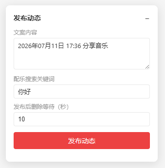

# 网易音乐人发布动态

在网易云音乐自动发布图文笔记（配乐动态），发布成功后自动删除，仅用于完成音乐人平台的发布任务指标。

## 安装

1. 安装 [Tampermonkey](https://www.tampermonkey.net/) 浏览器扩展
2. [点击安装脚本](https://github.com/YPJCoding/netease-musician-helper/raw/main/netease-musician-helper.user.js)

## 使用方法

1. 打开 https://music.163.com/#/friend
2. 页面右侧出现浮动面板
3. （可选）修改文案内容、配乐关键词、删除等待时间
4. 点击「发布动态」

## 截图

## 功能

- 自动生成带日期的默认文案（如"2026年07月11日 17:30 分享音乐"）
- 自动搜索并配上音乐
- 发布后指定秒数自动删除
- 面板可拖拽、可折叠
- 实时状态反馈

## 注意事项

- 需要先在浏览器中登录网易云音乐
- 发布后的笔记会在数秒后自动删除，不会留下内容
- 仅用于完成任务指标，请勿滥用

## 反馈

如有问题，请提交 [GitHub Issues](https://github.com/YPJCoding/netease-musician-helper/issues)。

## License

MIT
